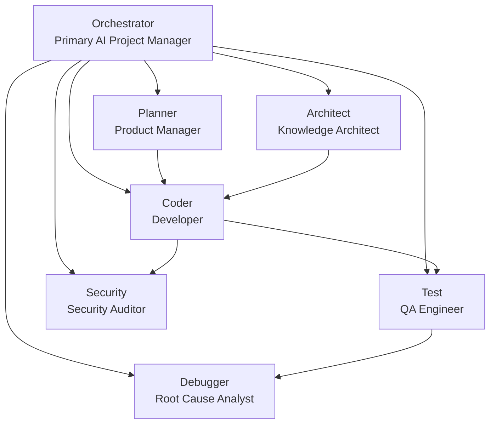
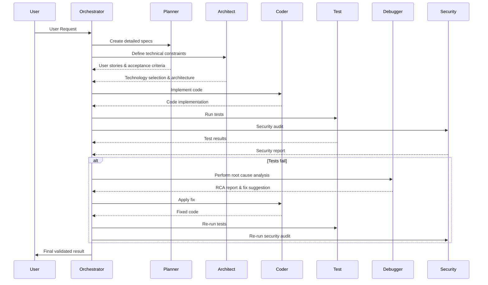
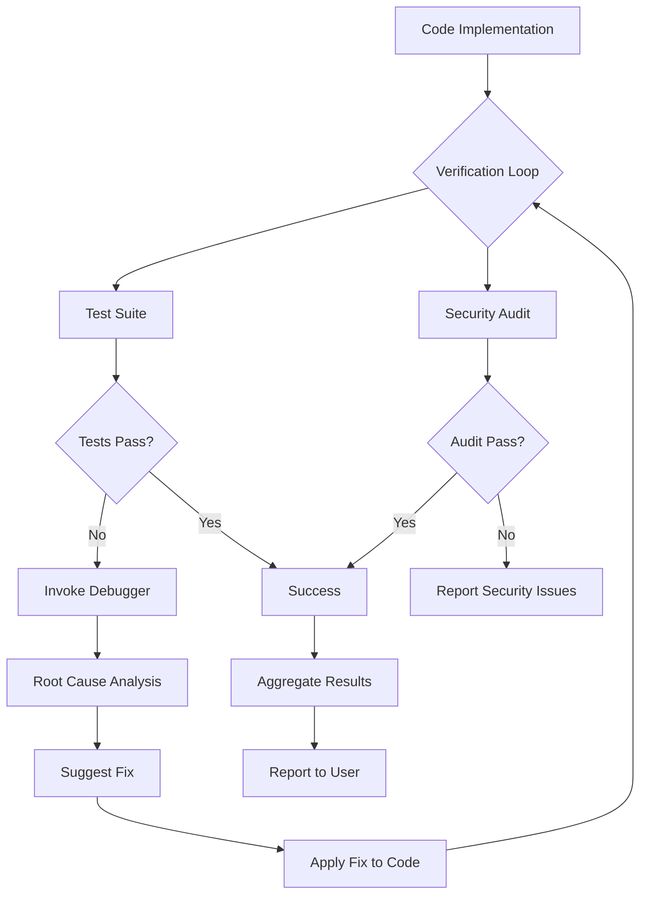

# HMAS Agents

Project for the blog: https://sionwilliams.com/posts/2025-11-03-my-agent-army/

## Agent Architecture

The HMAS Agents system uses a hierarchical agent architecture with specialized roles for different aspects of software development.

### Agent Hierarchy

### Development Workflow

### Verification Loop

## Agent Roles

- **Orchestrator**: Manages the entire development workflow and delegates tasks to specialized subagents
- **Planner**: Breaks down high-level goals into detailed specifications, user stories, and acceptance criteria
- **Architect**: Defines technical constraints, selects technologies, and ensures architectural alignment
- **Coder**: Implements code based on plans from Planner and Architect
- **Test**: Generates and runs tests, performs self-healing for simple failures
- **Debugger**: Performs root cause analysis when tests fail
- **Security**: Audits code for vulnerabilities and compliance issues
